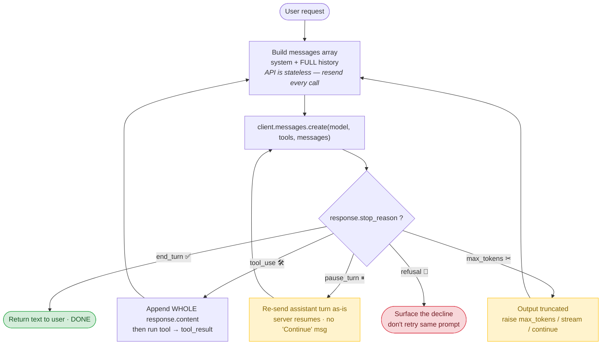
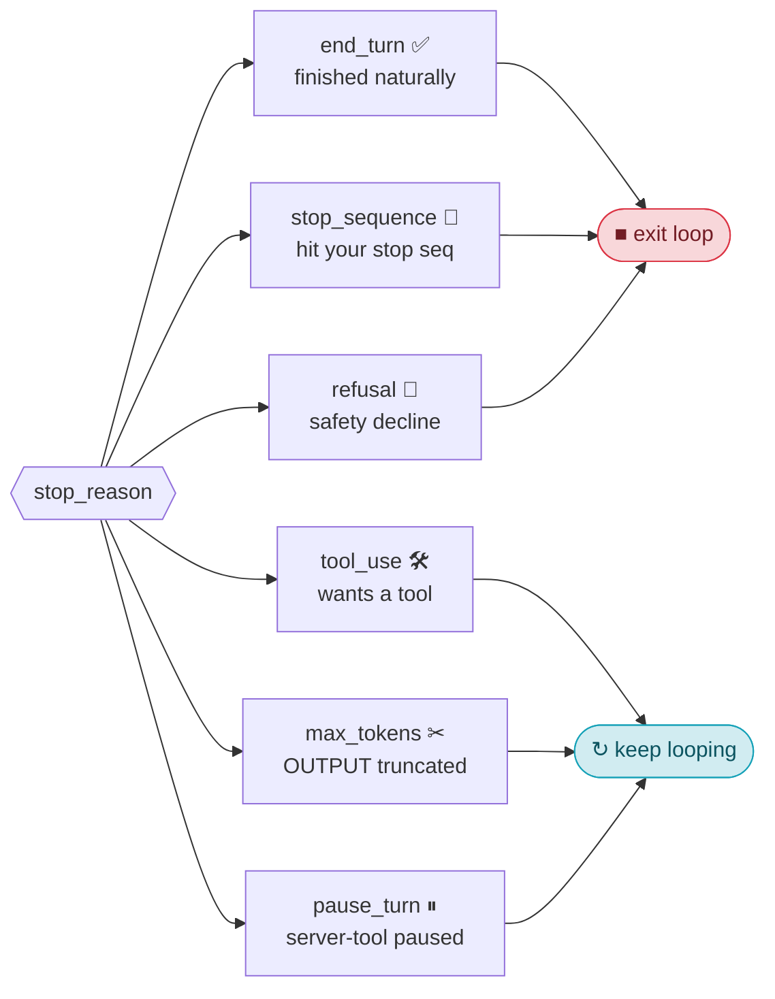
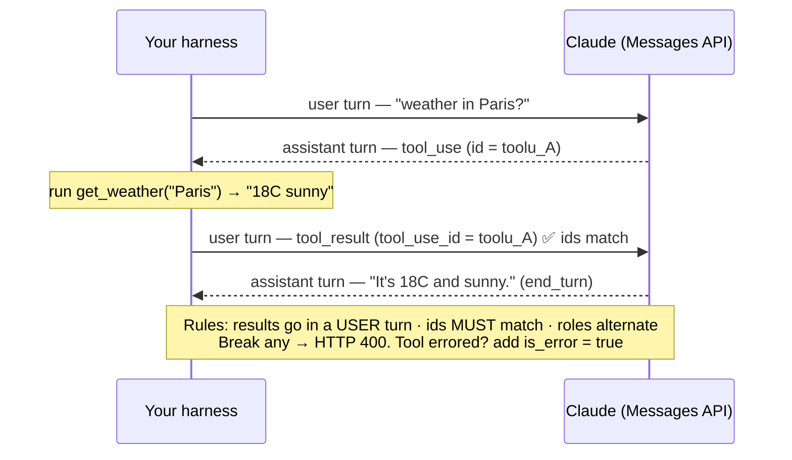
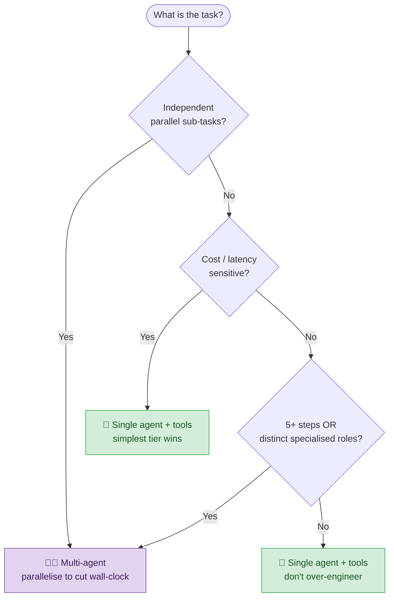
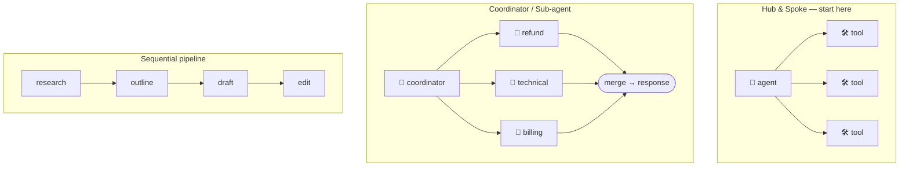
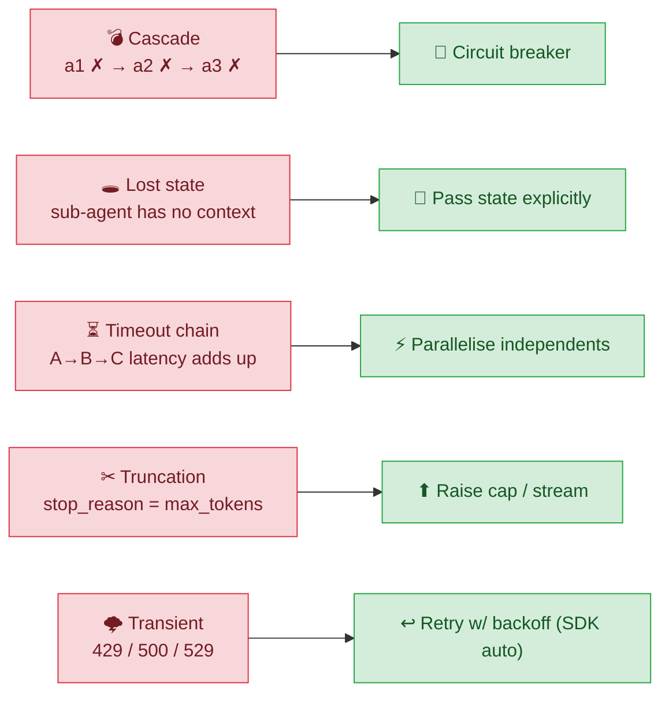
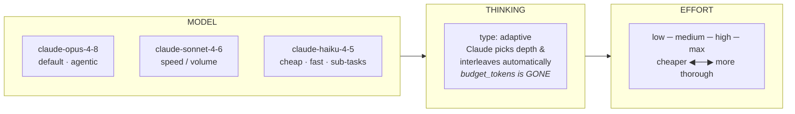

# D1 — Visual Cheat-Sheet 🖼️

> These are **Mermaid** diagrams. GitHub renders them as real graphics automatically —
> just view this file on github.com. In VS Code, install the *Markdown Preview Mermaid Support*
> extension (or the built-in preview) to see them locally.

---

## 🔁 The Agentic Loop (the whole domain in one picture)

🧠 **Two things people forget:** the API is **stateless** (you resend the full history every
call), and you must append the **whole** `response.content` (with its `tool_use` block), not
just the `.text`.

---

## 🚦 `stop_reason` — router + loop control

⚠️ Six values total — the "4-value" list in most guides is **incomplete**.
`max_tokens` = the **output** was cut off, **not** "conversation too long."

---

## 🧩 The tool-result contract (why you get a 400)

---

## 🤖 vs 🤖🤖 — single or multi-agent?

Golden rule: **pick the simplest tier that works.** The exam punishes over-engineering.

---

## 🕸️ Orchestration patterns

🔑 Sub-agents are **context-isolated** — they don't see the coordinator's history.
Pass what they need **explicitly**.

---

## 💥 Failure modes → fixes

Recovery ladder: **retry** (transient) → **fallback** (alt / skip) → **escalate** (human).

---

## 🎛️ The knobs (model · thinking · effort)

Big `max_tokens` (≳16K)? → **stream** to avoid HTTP timeouts.
